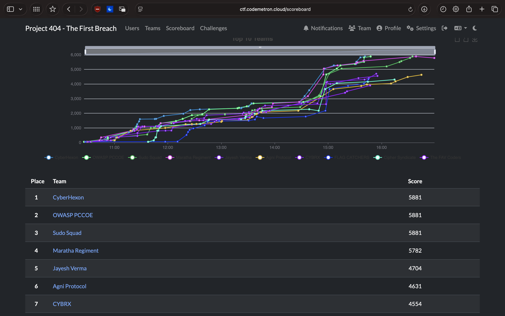
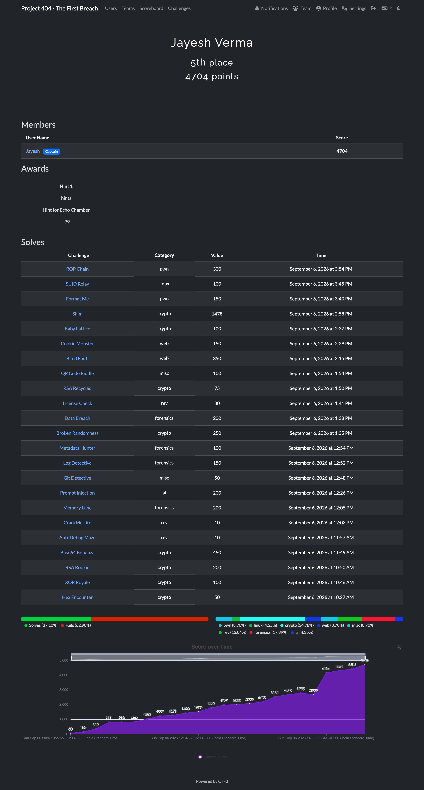

# 🚨 Project 404 CTF

> **One player. Eight categories. Multiple challenges. One leaderboard.**

This repository contains my **write-ups, challenge files, scripts, notes, and working material** from the **Project 404 CTF**, organized by the **Indira University School of Information Technology** on **6 September 2026**.

Project 404 was a hands-on, team-based cybersecurity CTF covering everything from **cryptography and web exploitation to reverse engineering, binary exploitation, digital forensics, Linux privilege escalation, and AI security**.

And there was a small twist in my challenge:

**Most teams had three members. I played solo.**

Despite competing independently, I managed to finish **among the top performers on the leaderboard**.

---

## 🏆 The Challenge

The CTF was designed as a practical introduction to different areas of cybersecurity. Instead of focusing only on theory, the challenges required investigation, experimentation, debugging, exploitation, and a lot of trial and error.

The competition covered **8 major categories**, each with its own collection of challenges.

### 🤖 AI

Adversarial Patch · Model Extraction · Neural Nightmare · Prompt Injection

### 🔐 Crypto

Baby Lattice · Base64 Bonanza · Broken Randomness · Hex Encounter · RSA Recycled · RSA Rookie · Shim · XOR Royal

### 🔎 Forensics

Data Breach · Log Detective · Memory Lane · Metadata Hunter

### 🐧 Linux

Capability · SUID Relay

### 🧩 Miscellaneous

Git Detective · QR Code Riddle

### 💥 Pwn

Buffer Overflow 101 · Format Me · ROP Chain · Void Machine

### ⚙️ Reverse Engineering

Anti-Debug Maze · CrackMe Lite · License Check

### 🌐 Web

Blind Fait · Cascade · Cookie Monster · Echo Chamber

---

## 📂 Repository Structure

```text
Project-404-CTF/
│
├── ai/              # AI security challenges
├── crypto/          # Cryptography challenges
├── forensics/       # Digital forensics challenges
├── linux/           # Linux & privilege escalation
├── misc/            # Miscellaneous challenges
├── pwn/             # Binary exploitation
├── rev/             # Reverse engineering
└── web/             # Web security
```

Each challenge directory may contain:

* Challenge descriptions
* Notes and observations
* Exploit / solve scripts
* Challenge files
* Commands and outputs
* Analysis
* Recovered flags

The goal is not just to store the final answers, but to document the **process of getting there**.

---

## 📊 Dashboard

### Dashboard Overview



### Additional Dashboard View



---

## 🧠 What I Worked With

Across the challenges, the CTF provided practical exposure to:

| Area                     | Concepts                                                       |
| ------------------------ | -------------------------------------------------------------- |
| 🤖 AI Security           | Adversarial attacks, model extraction, prompt injection        |
| 🔐 Cryptography          | RSA, XOR, Lattice problems, encoding, randomness               |
| 🔎 Forensics             | Logs, metadata, memory and data analysis                       |
| 🐧 Linux                 | Capabilities, SUID and privilege escalation                    |
| 💥 Pwn                   | Buffer overflows, format strings, ROP                          |
| ⚙️ Reverse Engineering | Debugging, binary analysis, license checks                     |
| 🌐 Web                   | SQL injection, authentication, cookies and web vulnerabilities |
| 🧩 Misc                  | Git investigation, QR-based challenges                         |

---

## 🎯 The Solo Run

The most memorable part of Project 404 wasn't just solving individual challenges.

It was doing it **alone**.

While most teams were working with three participants, I decided to take on the competition independently and still finished **among the top performers on the leaderboard**.

### 🏆 Top-Tier Solo Finish

Competing solo meant every challenge had to be approached independently — from understanding the vulnerability and testing ideas to debugging failed attempts and finally recovering the flag.

---

## 🔥 Why Project 404 Was Interesting

What made the CTF stand out was the variety.

One challenge could have you thinking about cryptographic mathematics, while the next required understanding Linux permissions, analyzing a binary, exploiting a web application, or figuring out how an AI model behaves.

It was a good reminder that cybersecurity isn't one single skill.

Sometimes it's:

```text
Understand → Investigate → Break → Debug → Adapt → Solve
```

And occasionally:

```text
Try something completely wrong
        ↓
Get a weird result
        ↓
Investigate why
        ↓
Find the actual vulnerability
        ↓
🚩 FLAG
```

---

## 📚 Takeaways

Project 404 gave me practical exposure to a wide range of cybersecurity domains and, more importantly, an opportunity to apply concepts outside of a classroom environment.

The experience reinforced the importance of:

* Thinking beyond the obvious solution
* Understanding how systems behave rather than just how they are supposed to behave
* Reading challenge files and source code carefully
* Using tools effectively
* Debugging failed attempts instead of immediately abandoning them
* Approaching unfamiliar technologies with curiosity

Most importantly, **playing solo and finishing among the top performers made the experience even more memorable.**

---

## 🚩 Final Note

This repository is a collection of my **Project 404 journey** — the challenges, experiments, scripts, mistakes, and solutions that helped me reach the leaderboard.

**Thanks to the Indira University School of Information Technology for organizing Project 404 CTF.**

> **Learn. Break. Investigate. Solve. Repeat.**

---

**Project 404 CTF — 6 September 2026**
**Solo Participant · Top-Tier Finish**
